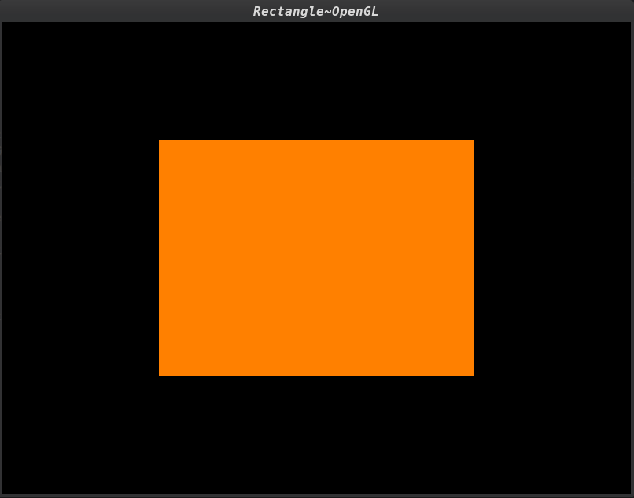

# Rectangle

Recently, I started learning [OpenGL](https://www.opengl.org/). 

So to test my skills and see some colored figure rather than a black screen, I made this mini-project.

---

## Things in Rectangle

### GLAD

It is an OpenGL Loading Library that loads pointers to OpenGL functions (core and extensions both) at runtime. There are many such libraries like [GLEW](https://glew.sourceforge.net/) and [Galogen](https://galogen.gpfault.net/), but I decided to go with [GLAD](https://github.com/Dav1dde/glad). 

```cpp
#include "glad/glad.h"
```

---

### [GLFW](https://www.glfw.org/)

It is an Open Source, multi-platform library for OpenGL, OpenGL ES and
Vulkan development on the desktop. It provides a simple API for creating
windows, contexts and surfaces, receiving input and events.

```cpp
#include "GLFW/glfw3.h"


int main() {
    //initialise the library
    if (!glfwInit())
        return -1;

    GLFWwindow* window;

    // create a window and its OpenGL context
    window = glfwCreateWindow(800, 600, "Rectangle~OpenGL", NULL, NULL);
    if (!window) {
        glfwTerminate();
        return -1;
    }

    //make the window's context current
    glfwMakeContextCurrent(window);

} //function-main
```

---



